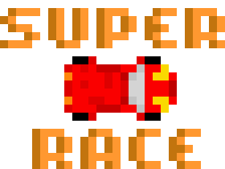

<div align="center"></div>

# SuperCarRace
A Super Car Race using python

# Getting Started
To run the game, simply run **run.py** file

To run the AI learning process, run **LearningRun.py**

All of the configuration can be found in *assets/config.txt* and *AI.py* files

## Prerequisites
[Pygame](https://github.com/pygame/)

[NEAT-Python](https://github.com/CodeReclaimers/neat-python)

```
pip install -r requirements.txt
```
